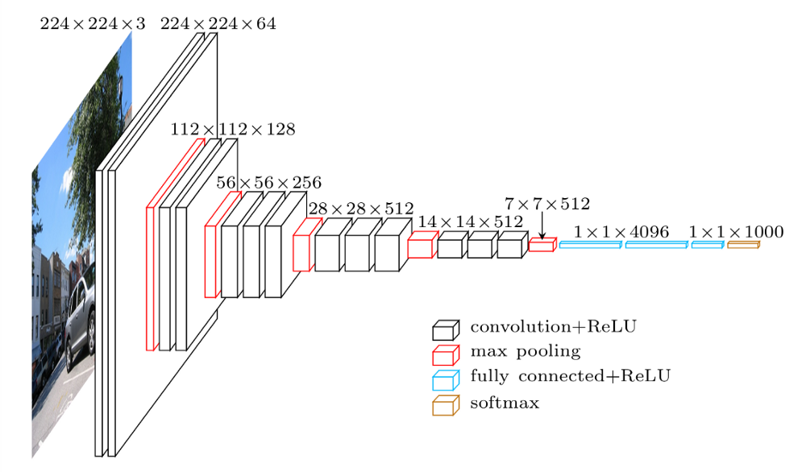
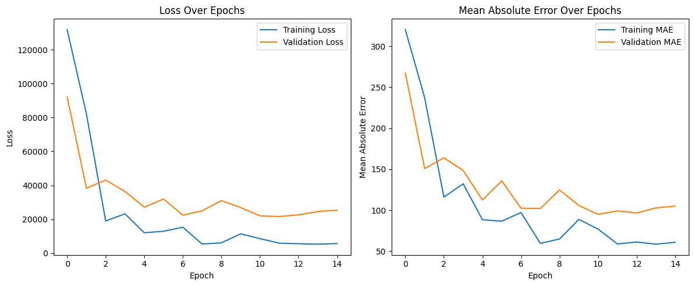

# deep_transfer_pricing


This guide introduces an image-based price prediction model, focusing on predicting property prices per square foot (PPSF) from images. The model employs transfer learning, utilizing a pre-trained VGG19 model as a base. This approach is particularly useful for individuals or developers who are not familiar with the intricacies of deep learning or transfer learning, an ideal starting point for anyone looking to dive into the world of AI with a focus on real-world applications.


## Role of VGG19

VGG19 is a deep learning model designed for image classification, originally trained to recognize 1,000 different categories of objects in images (like cats, dogs, cars, etc.). It's part of the family of models that have been pre-trained on a massive dataset called ImageNet, which contains millions of images. The strength of VGG19 lies in its architecture, which can capture complex patterns in images through its many layers.





## Classification to Regression

The task of classification involves categorizing images into predefined classes, which is what VGG19 was initially designed for. However, our goal is different. We want to predict a continuous value (the property price per square foot) based on the input image, which is a regression task. Regression differs from classification in that it deals with predicting a continuous quantity instead of assigning a label from a set of categories. To repurpose VGG19 for our regression task, we follow these steps:

- **Freezing the Base Model**: We start by taking the VGG19 model without its top layer (the part responsible for classification) and freeze its weights. Freezing means we won't update the weights during training; this is crucial because VGG19 already knows how to extract useful features from images, and we don't want to lose that knowledge.

- **Custom Top Layers**: Next, we add a new set of layers on top of VGG19. These layers are designed to take the complex patterns identified by VGG19 and use them to predict property prices. This part of the model is trainable, meaning it will adjust its weights based on our specific dataset.
    - **Flatten Layer**: Converts the 2D features maps produced by VGG19 into a 1D vector. This step is necessary because the following dense layers expect input in a flat form.
    - **Dense Layers**: These are fully connected layers that learn to associate the features extracted by VGG19 with property prices. The first dense layer uses ReLU (Rectified Linear Unit) activation to introduce non-linearity, allowing the model to learn complex relationships. The dropout layer helps prevent overfitting by randomly "dropping" a fraction of the neurons during training, making the model more robust.
    - **Output Layer**: The final dense layer has a single neuron because we're predicting a single continuous value (the PPSF). It does not use an activation function because we want the raw output value, which represents the predicted price.


## Training the Model

With the model set up, we proceed to train it using our dataset of images and their corresponding PPSF values. The model learns to fine-tune the weights of the added layers (while the base VGG19 layers remain unchanged) to minimize the difference between the predicted and actual PPSF values. This process involves backpropagation and optimization techniques that adjust the model based on the error in its predictions.


## Prerequisites

- Python 3.x
- Libraries: `NumPy`, `Keras`, `TensorFlow`, `Matplotlib`, `scikit-learn`


## Dataset

The `data.json` file contains a dataset used for training the real estate price prediction model. Each entry in the dataset represents a single real estate property with the following attributes:

- `ID`: A unique identifier for each property.
- `FilePath`: The relative path to the image file of the property. The images are stored in the `assets` folder and are named according to their corresponding ID. For example, `assets/1.jpg`.
- `PPSF`: The price per square foot (PPSF) value of the property. This is a numerical value that represents the property's market value in terms of its area.

### Sample Data

Below is a snippet of the dataset showing the format and type of data included:

```json
[
    {
        "ID": 1,
        "FilePath": "assets/1.jpg",
        "PPSF": 433
    },
    {
        "ID": 2,
        "FilePath": "assets/2.jpg",
        "PPSF": 417
    },
    {
        "ID": 3,
        "FilePath": "assets/3.jpg",
        "PPSF": 425
    }
]
```


## Model Workflow

- **Data Preparation**: Load image paths and PPSF values from a JSON file. Preprocess the images to fit the input requirements of the VGG19 model.
- **Transfer Learning Setup**: Use the VGG19 model, pre-trained on ImageNet, as a base. The top layers are not included, allowing us to add custom layers for our specific task.
- **Model Architecture**: A Sequential model is built on top of VGG19's base, adding a Flatten layer, a Dense layer with ReLU activation, a Dropout layer for regularization, and a final Dense layer for output.
- **Model Compilation**: The model is compiled with the Adam optimizer, mean squared error loss, and tracks mean absolute error (MAE) as a metric.
- **Training**: The model is trained with the prepared dataset, using a portion of the data for validation.
- **Evaluation**: Training and validation loss, along with MAE, are plotted over epochs to visualize the learning process.
- **Model Summary**: Display the architecture of the final model.

## Implementation Steps

### Data Loading and Preprocessing

- Load JSON data containing image paths and PPSF values.
- Preprocess images to conform with VGG19 input requirements.

### Model Setup

- Initialize VGG19 as the base model, freezing its weights to prevent them from being updated during training.
- Add custom layers to adapt the model to our specific task of predicting PPSF values.

### Model Training and Evaluation

- Split the dataset into training and validation sets.
- Train the model on the training set and evaluate its performance on the validation set.
- Plot the training history to assess the learning process.


## Usage

Upon executing main, users can expect the following outcomes from the model:

- **Training and Validation Loss**: The model demonstrates a significant decrease in both training and validation loss over 15 epochs, starting from an initial loss of 124807 (training) and 144675 (validation) to final losses of 7030 (training) and 25919 (validation), respectively. This indicates the model's ability to learn and adapt from the data over time.

- **Mean Absolute Error (MAE)**: The MAE metric, which provides an average of the absolute errors between predicted and actual values, shows improvement. The training MAE decreased from 305 to 63, and the validation MAE improved from 331 to 106 over the epochs. These improvements reflect the model's increasing accuracy in predicting property prices per square foot (PPSF).

- **Model Architecture**: The model is built using pre-trained architecture as a base, with additional custom layers for regression, including Flatten, Dense, and Dropout layers. The total parameter count for the model is 26,447,425, with 6,423,041 parameters being trainable. This architecture enables the model to effectively extract and learn from the features in the real estate images.

- **Plots for Insight**: Users will have access to two plots showing the training history of the model. These plots visualize the loss and mean absolute error over the epochs, providing clear insights into the model's learning progress and performance improvement over time.





## Next Steps

This project provides a solid foundation in applying deep learning techniques to real estate price prediction. However, there's always room for expansion and improvement. Here are several ways you could take this project further:

- **Incorporate More Data**: Enhancing the dataset with more images or additional features (e.g., location, number of bedrooms) could improve the model's accuracy and robustness.

- **Experiment with Different Models**: While VGG19 is a powerful model, experimenting with other pre-trained models like ResNet, Inception, or EfficientNet could provide insights into different architectures' effectiveness for this task.

- **Implement Advanced Preprocessing**: Exploring more sophisticated image preprocessing and augmentation techniques could help the model learn from a more diverse set of features and improve generalization.

- **Optimize Model Parameters**: Fine-tuning the model's hyperparameters, such as the learning rate, batch size, or the architecture of the fully connected layers, can lead to better performance.

- **Cross-Validation**: Implementing cross-validation techniques could provide a more reliable estimate of the model's performance on unseen data.


- **Explore Different Use Cases**: Beyond real estate price prediction, consider applying the same methodology to other domains, such as predicting the condition of a property, estimating construction costs, or identifying architectural styles.


## Conclusion

- **Educational Tool**: This project serves as an educational tool, providing a practical example of how to apply transfer learning and deep neural networks to a real-world problem.
- **Leveraging Pre-trained Models**: Leveraging a pre-trained model allows us to achieve significant results with a relatively small dataset. This approach showcases the power of transfer learning, where pre-existing knowledge about image features can be utilized for diverse applications.
- **Starting Point for Further Learning**: This project acts as a starting point for those interested in learning about the intricacies of transfer learning and deep neural networks, encouraging further exploration and experimentation in the field.
